# The Green Lunar Revolution

**Introduction:**

Paul _et al.,_ (2022) investigated the ability of plants to grow in lunar regolith and utilize it as a resource for life support in lunar habitats. Using the terrestrial plant Arabidopsis thaliana and samples from Apollo 11, 12, and 17, they found that the plants were able to germinate and grow in diverse lunar regoliths, but growth was challenging and many showed severe stress morphologies. Furthermore, all plants grown in lunar regoliths showed differential gene expression indicating ionic stresses similar to plant reactions to salt, metal, and reactive oxygen species (ROS). Therefore, while lunar regoliths can be useful for plant production in lunar habitats, they are not benign substrates, and further research is needed to elucidate the interaction between plants and lunar regolith and mitigate any negative effects. This study provided important insights into the potential use of in-situ resources for life support on other worlds, particularly the Moon.

The Green Revolution of the 1960s saw significant increases in cereal crop yields, primarily due to the introduction of high-yielding varieties of wheat and rice. The incorporation of dwarfing genes into these plants was crucial to this revolution as tall plants were unable to support the weight of the heavy grain and tended to lodge, causing significant yield losses. Dwarfing genes resulted in shorter, stronger stalks that did not lodge and increased the amount of assimilate partitioned into the grain, leading to further yield increases. The genes responsible for this semi-dwarf growth habit have now been identified as the Reduced height (_Rht_) genes in wheat and the semi-dwarf1 (_sd1_) gene in rice. These genes interfere with the signal transduction pathway of the gibberellin (GA) growth hormone, which plays a central role in controlling plant stature. The dwarfing genes in wheat are semi-dominant alleles of homologous genes on chromosomes B and D, while the dwarfing gene in rice was identified as a defective enzyme in the GA biosynthetic pathway. These genes have been incorporated into many wheat and rice cultivars worldwide and have had a significant positive impact on global food production. However, these dwarf wheat crops are potentially more likely to have difficulty growing in lunar regolith.

The Green Revolution has led to a significant increase in grain yield, but this has come at the cost of nitrogen use efficiency (NUE). NUE is the amount of nitrogen that is absorbed by plants and used for growth and development, relative to the amount of nitrogen that is applied. High-yield crops typically have lower NUE than low-yield crops. Gibberellin (GA) signalling is a key factor in regulating plant growth and development. GAs are hormones that control a wide range of plant processes, including nitrogen uptake. GAs also play a role in the regulation of chromatin, which is the packaging of DNA in the nucleus. Chromatin modulation can affect gene expression, and GAs can alter chromatin in a way that promotes the expression of nitrogen-responsive genes.

The mechanisms underlying the cross-talk between GA- and nitrogen-responsive gene networks are starting to be unravelled. This information could be used to develop new strategies for increasing NUE in crops. One possibility is to manipulate the GRF4-DELLA-NGR5 module (Wu _et al_., 2021). This module is involved in the regulation of both GA signalling and chromatin modulation. By manipulating this module, it may be possible to increase NUE without sacrificing grain yield. The development of new strategies for increasing NUE is essential for the future of agriculture. As the world's population continues to grow, the demand for food will also increase. In order to meet this demand, we need to develop sustainable ways of producing food. Increasing NUE is one way to achieve this goal.

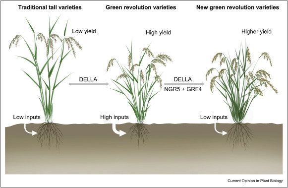

Ref-> [https://www.sciencedirect.com/science/article/abs/pii/S1369526621000741?via%3Dihub](https://www.sciencedirect.com/science/article/abs/pii/S1369526621000741?via%3Dihub)

**Figure XX:** Stable diffusion used to help imagine an underground robotic farm that uses light to convert regolith into biomass. Engineering the environment “Amending the soil structure”. Engineering the genetics of future lunar permaculture programs.

When Paul _et al.,_(2022) looked at the gene expression data based on the plants' growth success rather than the specific location they were grown in, they found that even the plants that appeared more successful (similar in size and shape to those grown in JSC-1A simulant) had transcriptomes indicative of strong stress response. The plants were categorized into three phenotypic groups of three plants each: "Severe" (small with distorted shape and reddish-black pigmentation throughout), "Small" (small but green and proportionate), and "Large" (larger than other regolith-grown plants, with normal pigmentation and shape, similar to JSC-1A phenotype, but still smaller than JSC-1A-grown plants). These phenotypes resemble those of GA dwarf mutants, which have similar slow growth, developmental delays and morphology defects due to a mutation in the gibberellin hormone pathway or downstream via mutation in GA receptors or the DELLA proteins they regulate via tissue-specific patterns of ubiquitin E3 ligase targeted degradation. Molecular and physiological studies have demonstrated that DELLA proteins, which were once considered as master negative regulators of GA signalling, actually integrate multiple hormone signalling pathways through physical interactions with transcription factors or regulatory proteins from different families.

Paul _et al.,_ (2022), also analyzed the transcriptomes of plants grown in lunar regolith from different Apollo sites to better understand the basis of their stress morphologies. They found that plants grown in Apollo 11 regolith showed the most differentially expressed genes (DEGs), followed by Apollo 12 and Apollo 17. All lunar samples evoked DEGs associated with ABA signalling, salt, metal, and reactive oxygen species stresses, with a strong representation of nutrient metabolism genes. The most highly induced and repressed DEGs were associated with phosphate and nitrogen starvation. Plants from each Apollo sample also differentially expressed genes unique to each site, indicating a discernable and distinguishing plant response based on lunar regolith sample. The results suggest that plant responses vary based on the lunar regolith source and that lunar regolith is more stressful than JSC-1A simulant. However, they observed a range of growth success states within each lunar regolith sample, indicating the potential for successful plant growth in the lunar regolith.

**Methods: Principal component analysis and deep learning clarifies hormonal**

The lunar regolith sample (GLDS-XXX) statistical reanalysis using GAGE gene set enrichment correlation analysis, Principal component pathways correlation analysis with KEGG pathway library and changes to the ribosome and defence metabolism pathways using KEGG pathview. Linear models of all lunar locations broadly grouped vs the regolith simulant was used to calculate differential expression using DESeq2 and DEG list correlation with KEG, GO and Reactome was used to calculate changes in metabolic and signalling processes related to plant hormone signalling. Instead of separating the lunar locations or grouping the sample based on the plant phenotype instead we grouped all the lunar samples into one “Broad Lunar” group allowing us to formulate the Broad Lunar Regolith model of terrestrial differentiation.

[Link to supplemental data](https://docs.google.com/spreadsheets/d/1l3QPyZNJN0Ed3uDyDlk2Ulwe7vfN\_DcNGFpiGytuOg4/edit?usp=sharing).



_Summary of the different plant response to Regolith vs simulant._

GAGE analysis (**Figure X**) reveals suppression of Ribosomes as the major component of the data; they are vital for protein synthesis, and composed of RNA and protein subunits. The suppression of their expression can be analyzed using KEGG pathview revealing how ribosome biogenesis involves changes to subunit assembly. The DNA repair and replication system that generates two identical copies during chromosomal unwinding is suppressed along with the DNA synthesis, homologous recombination and DNA mismatch repair pathway. Glucosinolate biosynthesis genes are being suppressed in the lunar samples and producing sulfur-containing compounds for plant defence. Other parts of the Plant-pathogen interaction pathway are also affected which will alter the plants PAMP recognition system. The loci involved in 2-Oxocarboxylic acid metabolism, a process that generates ATP and precursor molecules is also suppressed along with core metabolic processes involved in Valine, leucine, and isoleucine biosynthesis. In contrast, it is only the phenylpropanoid biosynthesis pathway that appears elevated in these GAGE analyses. Taken together the pathway analysis shows the plants are slowing their growth in a manner that in part resembles that of plants experiencing mechanical stimuli along with all the downstream nutritional deficits (REF).

_Summary of the hormonal response of Arabidospsi to Regolith vs simulant using BROAD lunar model._

A Closer look at hormonal signalling pathway in the BROAD lunar model using KEGG pathview (**Figure X**) for lunar samples vs simulants reveals evidence for changes in not just ABA signalling but also changes to SA, Ethylene, JA, IAA and GA metabolism. DELLA proteins play a crucial role in regulating multiple hormone signals that control various plant processes. For example, DELLA interacts with BZR1, ARF6, and PIF4 to modulate GA, BR, and light/temperature signalling, thereby affecting hypocotyl cell elongation. In addition, DELLA inhibits the function of EIN3, a protein that is essential for ET-mediated apical hook formation. This interaction affects the expression of HLS1 and RAP2.3, which are crucial for this process. Changes in DELLA stability could, therefore, impact apical hook formation in plants grown on the moon, affecting their ability to respond to gravity and other environmental cues. DELLA plays a role in plant defense mechanisms by positively regulating JA-mediated resistance to herbivory and necrotrophic pathogens. Changes in DELLA stability could impact the plant's ability to defend itself against pests and diseases on the moon, where the absence of a significant atmosphere could increase the risk of such problems. DELLA mediates GA- and CK-dependent regulation of photomorphogenesis, which is crucial for plant growth and development. Changes in DELLA stability could affect this process, impacting the overall health and productivity of lunar crops.

**Is there evidence for a broad remodelling of DELLA transcriptional hub stabilization?**

Changes in the expression of stress-responsive transcription factors that can be observed via changes in PIF, MYC2, NAC, ERF and WRY transcription factors along with the loci they regulate can be detected. These loci feedback on the regulation of both GA biosynthesis and catabolic enzymes. Colebrook _et al._, (2014) discuss the regulation of gibberellic acid (GA) metabolism and signalling during terrestrial abiotic stress in plants. Meta-Analysis of publicly available microarray data reveals abiotic stresses including cold, salt, osmotic, or dehydration stress cause plants reduce GA content through upregulation of GA methylation / deactivation genes, with addition to the downregulation of GA20ox and/or GA3ox biosynthetic genes, this duel regulation of both GA synthesis and degradation mechanisms can used to slow growth as a stress response system. The suppression of CPS is evidence of suppression of fundal slowing of metabolism. The suppression for GA20ox1 in the shoots indicates they are experiencing osmotic stress (Colbrook et al., 2014). There is a small but consistent increase in expression in each of the GA GID receptors potentially indicating that the plants have increased sensitivity to GA, which is part of a known positive feedback loop caused by GA deficiency (Griffis et al 2006). There is a pronounced increase in the expression of a GA methylation enzyme that is known to deactivate C19 GAs, demonstrating that the plant is perceiving stress and activating and suppressing growth in response. These data indicate a reduction in GA levels which is likely to lead to an increase in DELLA stability.

DELLA proteins are known to play an important role in regulating various cellular processes such as cell expansion, cellular defense metabolism, and cell division by interacting with other transcription factors. In plants, DELLA proteins act as negative regulators of growth and development by inhibiting the transcriptional activity of various transcription factors, such as PHYTOCHROME INTERACTING FACTORS (PIFs), basic helix-loop-helix (bHLH) transcription factors, and WRKY transcription factors. The interaction between DELLA proteins and PIFs is particularly important in regulating cell expansion. Under high levels of gibberellin (GA) hormones, DELLA proteins are degraded, which leads to the activation of PIFs and the subsequent activation of downstream genes that promote cell expansion. Conversely, under low levels of GA hormones, DELLA proteins are stabilized, which results in the inhibition of PIFs and the suppression of cell expansion.

DELLA proteins also play a crucial role in regulating cellular defense metabolism by interacting with other transcription factors such as JASMONATE-ZIM DOMAIN (JAZ) proteins. Under stress conditions, DELLA proteins bind to JAZ proteins, which leads to the activation of downstream genes involved in the biosynthesis of secondary metabolites that act as defense compounds against herbivores and pathogens.

This can be seen in the TF enrichment data (see deep dive slide show) where DELLA proteins are forming growing suppression complexes, these gene expression regulatory changes are downstream symptoms of changes to DELLA stability (REF). RGL3 is significantly increased in expression at the transcriptional level, this has been shown previously in shoots in response to dehydration stress ((Colbrook et al., 2014). The changes in regolith are different to those described in Colebrooke et al., (2014) are similar but different from the lunar regolith response which is more closely responsible for a combination of flood and mechanical would similar to herbivory.

Finally, in regulating cell division, DELLA proteins interact with a class of transcription factors called GRAS (GIBBERELLIN ACID INSENSITIVE, REPRESSOR OF ga1-3, and SCARECROW) proteins. The interaction between DELLA proteins and GRAS proteins inhibits cell division by preventing the expression of genes involved in cell cycle progression.

Overall, the interaction of DELLA proteins with various transcription factors plays a critical role in regulating cellular processes such as cell expansion, cellular defense metabolism, and cell division in plants.

We propose that the regulation of expression or activity of transcription factors that modulate the expression of GA metabolism genes could represent one mechanism by which GA signalling is integrated into the wider stress response network that can produce shorter, fatter roots (REF can also link to ethylene with link to spaceflight and/or soil compaction). Furthermore, DELLA protein signalling integrates developmental and environmental signals across many stages of development, integrating signals from multiple hormonal pathways in response to a range of environmental stresses.

**Conclusion**

In conclusion, the reduction in CPS (GA precursor supply) and a reduction in GA3ox medicated GA activation. This combined with an increase of GA deactivation by both 2-carbon oxidation and methylation suggests a decrease in bioactive GA levels. The reduction in GA leads to the stabilization of DELLA proteins and activation of the plant wounding response. This will also cause a negative feedback loop that increases GA sensitivity by increasing the potential for GA perception by increasing levels of GID expression. These metabolic modelling results suggest a potential for the development of novel crop ideotypes through manipulation of the GA pathway. This raises the question as to whether the gain-of-function Rht dwarf wheat alleles resulting from polyploidy present an opportunity to engineer new crops that might be able to overcome these stressors. Taken together our metabolic modelling predicts that the plants GA levels are reduced, stabilizing DELLA proteins indicating that different response RHT alleles that have been developed in wheat may have an altered capacity to respond to the real lunar regolith. Hence polyploidy and the gain-of-function nature of the _Rht_ dwarf underutilized crop species with novel potential for new ideotypes that can overcome the alien stress provided by the regolith.

To cultivate crops on the lunar regolith, plants must be able to anchor their roots deep into the soil to obtain water and nutrients. To comprehend how removing the _Rht_ dwarf allele in wheat or restoring GA biosynthesis in rice roots can help crop roots grow deeper in the lunar regolith, we must first understand their significance in plant growth. The _Rht_ dwarf allele in wheat reduces the height of the plant, and it curbs the production of gibberellins, plant hormones that stimulate stem elongation. With the removal of this allele, wheat plants can grow taller, with longer stems, and deeper roots, as they can generate more gibberellins. Similarly, in rice, restoring GA biosynthesis in the roots can promote root growth, and targeting specific cell types or stages of development can facilitate the production of longer and deeper roots. Without this metabolic engineering of the cell GA levels the roots may grow slower and shorter, which limits the plant's capacity to access water and nutrients deeper in the soil or regolith. Thus, by removing the _Rht_ dwarf allele in wheat or restoring GA biosynthesis in rice roots or simply adding GA to the irrigation, the resulting plants can grow longer and deeper roots. These roots can help anchor them into the lunar regolith, enabling them to access the resources they need to sustain their growth. This could potentially facilitate sustainable crop growth on the moon, which is crucial for future human exploration and settlement.

**Transcriptomics predictions requires hormone quantification and other phenotyping data.**&#x20;

Prediction -> GA level are low

Prediction -> JA level are high

Prediction -> SA level are high

Prediction -> ABA level are high

Prediction -> Ethylene level are high

Prediction -> BR level are low

Prediction -> Cytokinin level are low

**In conclusion**, DELLA stability plays a critical role in regulating multiple hormone signals that affect plant growth, development, and defence mechanisms. Any changes in DELLA stability could have significant impacts on lunar farming, affecting the ability of plants to grow and thrive in a challenging environment. … _intentionally open ended…_

**Table XX:** Insert summary table of plant hormonal loci from the Broad Lunar model.

| **Symbol**             | **Gene ID**   | **Moon-Earth\_log2FoldChange** | **Moon-Earth\_padj** | **Function**               |
| ---------------------- | ------------- | ------------------------------ | -------------------- | -------------------------- |
| _**CPS**_              | **AT2G18620** | **-2.101**                     | **0.023**            | **GA precursor synthesis** |
| _KS_                   | AT4G02780     | -0.487                         | 0.198                | **GA precursor synthesis** |
| _**KO**_               | **AT5G25900** | **0.482**                      | **0.017**            | **GA precursor synthesis** |
| _KAO_                  | AT1G79460     | -0.521                         | **0.115**            | **GA12 biosynthesis**      |
| _GA20ox1_              | AT4G25420     | 0.004                          | 0.995                | Penultimate activation     |
| _GA20ox2_              | AT5G51810     | 1.156                          | **0.170**            | Penultimate activation     |
| _GA3ox1_               | AT1G15550     | -0.558                         | 0.378                | GA activation              |
| _GA3ox2_               | AT1G80340     | -1.078                         | 0.249                | GA activation              |
| _**GA2ox1**_           | **AT1G02400** | **-2.168**                     | **0.044**            | **GA deactivation**        |
| _GA2ox2_               | AT1G30040     | 0.139                          | 0.742                | GA deactivation            |
| _GA2ox4_               | AT1G47990     | 0.551                          | 0.494                | GA deactivation            |
| _GA2ox6_               | AT1G02400     | 0.528                          | 0.236                | GA deactivation            |
| _GID1a_                | AT3G05120     | 0.428                          | **0.162**            | **GA perception**          |
| _GID1b_                | AT3G63010     | 0.810                          | **0.167**            | **GA perception**          |
| _GID1c_                | AT5G27320     | 0.210                          | **0.148**            | **GA perception**          |
| _GA Methyltransferase_ | AT4G26460     | **2.037**                      | 0.380                | **GA deactivation**        |
| _GAI_                  | AT1G14920     | -0.114                         | 0.423                | GA signaling               |
| _RGA_                  | AT2G01570     | -0.096                         | 0.683                | GA signaling               |
| _RGL1_                 | AT1G66350     | -0.892                         | 0.083                | GA signaling               |
| _RGL2_                 | AT3G03450     | 0.424                          | 0.398                | GA signaling               |
| _RGL3_                 | AT5G17490     | 0.760                          | **0.181**            | **GA signaling**           |
| _SPY_                  | AT3G11540     | -0.020                         | 0.890                | GA signaling               |
| _GASA4_                | AT5G15230     | **-1.104**                     | **0.019**            | **GA signaling**           |
| _DWF4 BR Biosynthesis_ | AT3G50660     | **-0.056**                     | **0.046**            | **BA biosynthesis**        |

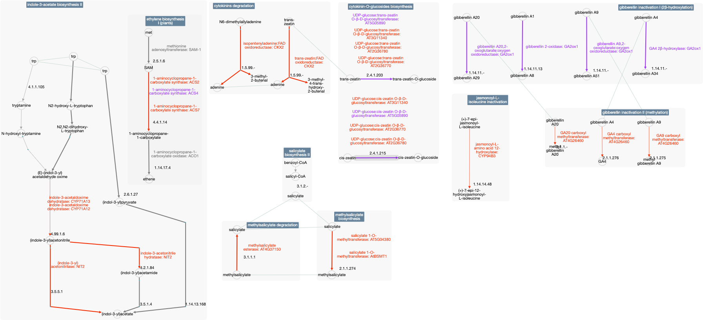

Figure XX: AraCyc hormonal pathway collage showing loci and reactions with a log fold change of more than 2 (from the Broad location modell V11).

**Is this needed?**

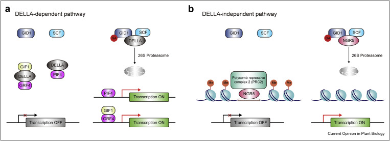

Source: [https://doi.org/10.1016/j.pbi.2021.102074](https://doi.org/10.1016/j.pbi.2021.102074)

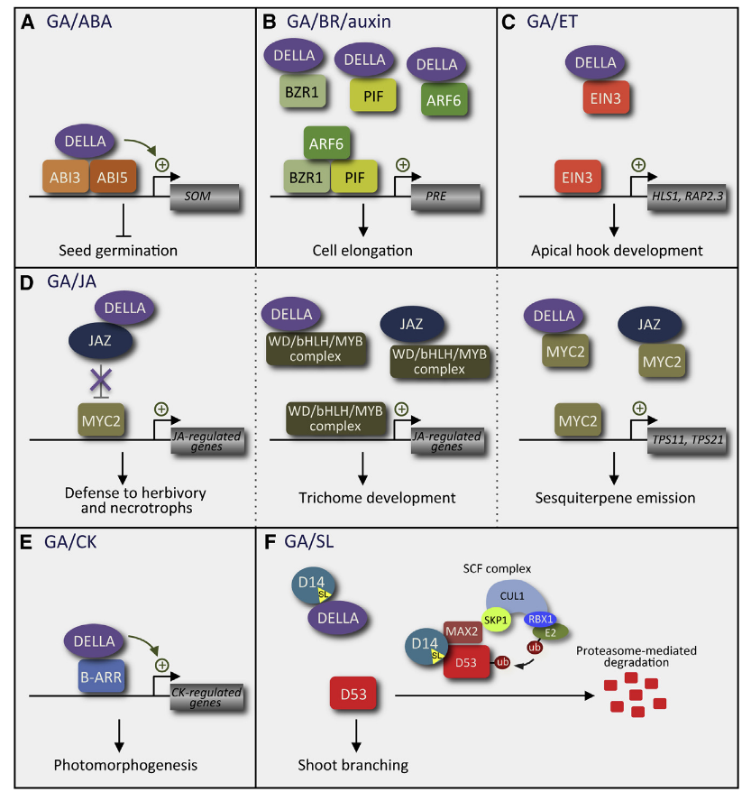

**Describe and discuss the genetics in the rearview / diagram**

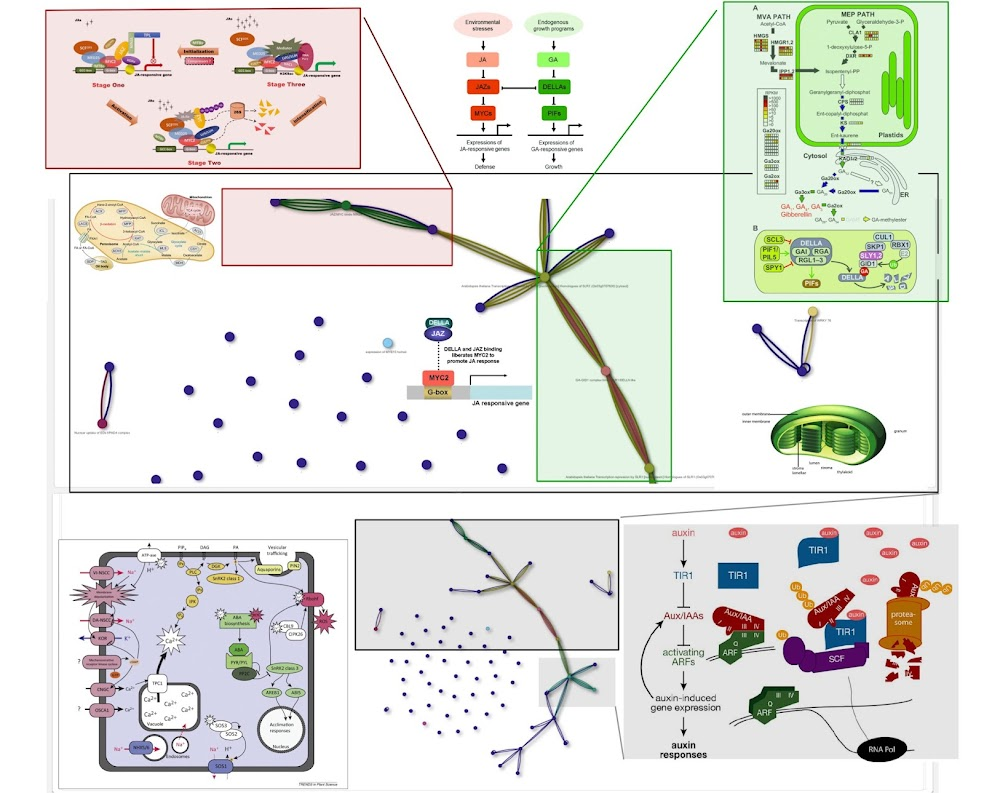

Note: -> this should be a simple table &/or heat map showing the

[DRB full reanalysis figures](https://docs.google.com/presentation/d/1BFprcp7zzBdi1luFcqVtUXI25qJImtgwWsIGVaGkdPA/edit?usp=sharing)

[DRB Summary](https://docs.google.com/presentation/u/0/d/1a\_\_b4exPY8by33kcYLlLfEo\_rVxcj7CM7w\_\_xbTRThE/edit)

**Note: These slides can be refined and exported from the slide show in a high resolution…**

[DRB Summary](https://docs.google.com/presentation/u/0/d/1a\_\_b4exPY8by33kcYLlLfEo\_rVxcj7CM7w\_\_xbTRThE/edit)

**Figure X**: Recent reanalyses of lunar samples have demonstrated varying degrees of stress-induced gene expression that strongly correlate with the geographic location of these samples on the Moon. This finding suggests a significant environmental influence on the molecular biology of organisms exposed to lunar conditions, warranting further investigation into the nature and implications of these variations.

Note: 50 pages below of other summary figures from the Broad lunar model.

**Figure x:** The signal indicative of the general adaptation response to starvation stress was pinpointed through GAGE (Generally Applicable Gene-set Enrichment) analysis focused on the KEGG (Kyoto Encyclopedia of Genes and Genomes) pathways associated with the ribosome and the phenylpropanoid biosynthesis pathway.

Each of the 3 locations exhibited a range of transcriptional responses with APPolo 11 exhibiting the greatest change in gene expression. Despight changes inthe number of differentially expressed genes in these coamprisons the pathways that respond are broadley similar. These samples can then be pooled to create a broad lunar model compares all the lunar regolith to the simulant.  we then used KEGG pathview to illustrate changes in the hormonal signaling pathways. This reveals a borad alteration to signaling systems associated with ethylene, gibberellin (GA), cytokinin,  jasmonic acid (JA), salasistic acid (SA) and auxin. These stress signals interact with the response to the perception of blue light and the regulation of the circadian rhythm in response to starvation.

**This is brainstorming, add GA related gravitropism narative?**&#x20;

With the refinement of the narrative the figures and be finalized.

 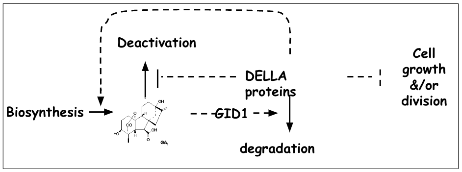 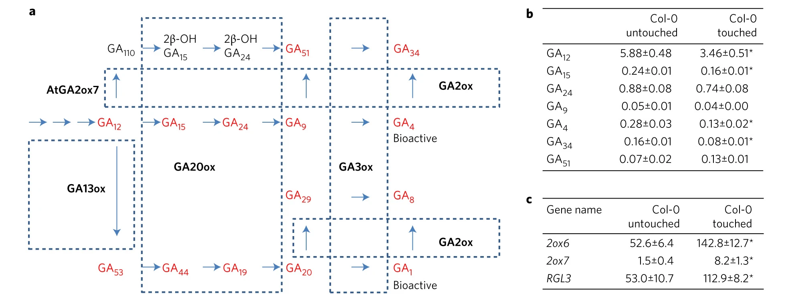

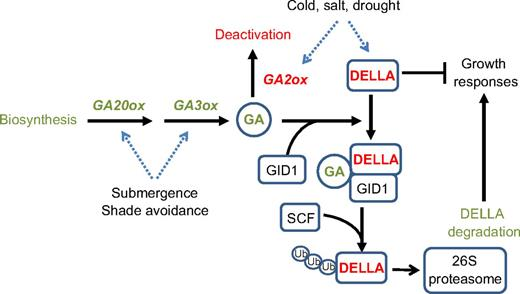 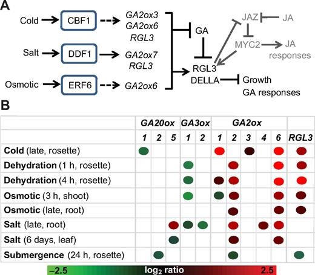 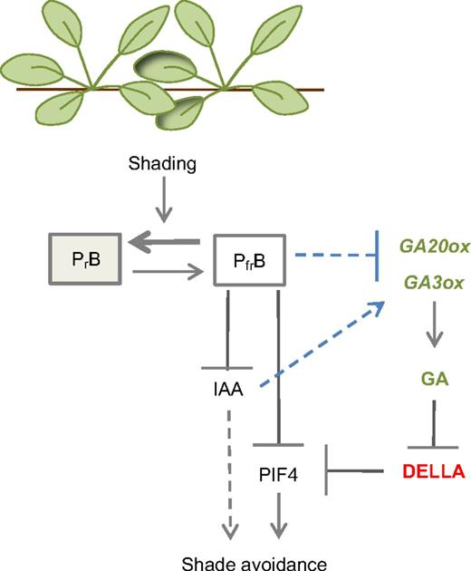

GA Figure Brainstorming: The addition of GA can make plants bigger.

&#x20;[Link to slide show on GA ](https://docs.google.com/presentation/d/1qOXxHaiaiWcOGvZV7kG1T9CR9LT4lEJVZy07Z0XnsOM/edit?usp=sharing)& role in touch response. Aka -> touch causes a reduction in GA levels, causing the plant to remain small

\-> Lange and Lange et al., (2015) -> touch induced changes in Arabidopsis morphology dependent on

Gibberellin breakdown.

&#x20;[Link to slide show ](https://docs.google.com/presentation/d/11fqhxVFi29cxjVGsJrUeRwj8jh1zZSKSJDIrsfqZqxE/edit?usp=sharing)on GA and gravitropism slides/narrative

\->https://journals.biologists.com/jeb/article/217/1/67/11961/The-role-of-gibberellin-signalling-in-plant

The GA pattern resembles wounding more than nutrient stress…

**Original analysis summary. The broad lunar soil stress response model: Reveals circadian rhythm, starvation and hormonal regulation of defence metabolism. Link to** [**Source figure/narrative slide show**](https://docs.google.com/presentation/d/1BFprcp7zzBdi1luFcqVtUXI25qJImtgwWsIGVaGkdPA/edit?usp=sharing) **that needs tidying**

## Analysis of Stress Response in Plants Exposed to Lunar Soil Conditions

### Introduction

Recent empirical evidence suggests that lunar soil exerts considerable stress on plant systems, significantly impacting their growth rates and defense mechanisms. This document aims to elucidate the primary stress response clusters identified in plants subjected to lunar soil, focusing on transcriptional activity, signaling pathways, metabolic processes, and circadian rhythm alterations.

### Stress Response Clusters

#### 1. Transcriptional Activity

Key transcription factors, including WRYK33, DREB2, AP2, NAC6, Kan1, and GBox – all known to be responsive to stress conditions – are observed to be upregulated. This upregulation indicates an enhanced expression of genes involved in stress adaptation mechanisms.

#### 2. Signaling Pathways

* **Cold Signaling**: There is a notable downregulation in cold signaling, suggesting a reduced response to low temperatures.
* **Auxin and Cytokinin Biosynthesis**: Both of these growth-regulating hormones show increased biosynthesis, likely as a compensatory mechanism to mitigate stress effects.
* **Defense Signaling**: A pronounced increase in defense signaling pathways, including those against fungal pathogens, has been observed. This is coupled with an upregulation in response to acid stress and Jasmonic Acid (JA) signaling, highlighting a multi-faceted defense response.
* **Photosynthesis and Carbon Metabolism**: Both processes are downregulated, illustrating the diversion of energy from growth to defense mechanisms.

#### 3. Metabolic Processes

* **Defense Metabolism**: There is a significant increase in defense metabolism, indicating an active production of defense compounds.
* **Oxidative Phosphorylation (Oxphos)** and **ERAD Protein Recycling Pathway**: Both pathways are upregulated, illustrating an increased energy production and protein recycling mechanism, respectively.
* **Protein Translation**: A downregulation in protein translation and ribosomal components is observed, further signifying the plant's shift from growth to stress response.

#### 4. Circadian Rhythm Alteration

The circadian rhythm is notably altered, partially through the modulation of CCA1 and TOC1, which could affect various physiological processes in plants, including growth and stress responses.

### Summary

Exposure to lunar soil conditions imposes significant stress on plant systems, manifesting in slowed growth and a pronounced activation of secondary defense mechanisms. Key response mechanisms include the enhancement of flavonoid, anthocyanin metabolism, and iron transport; suppression of transcription; and a robust defense metabolism focusing on JA, Reactive Oxygen Species (ROS), hypoxia, and defense against biotic stressors. Additionally, alterations in circadian rhythm, cold signaling, hormone synthesis, and microtubule function underscore the broad impact of lunar soil on plant physiology.

In conclusion, understanding these stress response clusters provides critical insights into plant resilience mechanisms under extraterrestrial conditions, contributing to our knowledge of plant adaptation and survival strategies in harsh environments.

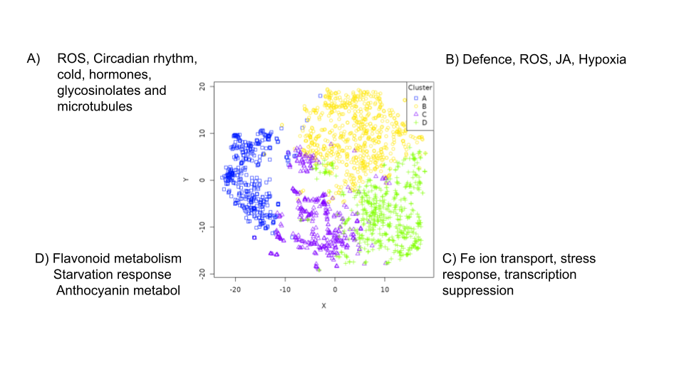

**4 clusters defined by Kmean**

#### Understanding the Aggregation of Lunar Samples: The Broad Lunar Model

In the pursuit of advancing our comprehension of the Moon's geology and its relationship with Earth, researchers have categorized lunar samples into a unified framework, referred to as the "Broad Lunar Model". This approach synthesizes the diverse array of samples gathered from the lunar surface into a cohesive linear model, facilitating a more comprehensive evaluation of the Moon's composition and its evolutionary linkage with Earth.

#### Comparative Analysis of True Lunar Regolith and JSC Simulate: Gene Expression Insights

***

This study presents a comprehensive analysis comparing the gene expression profiles of organisms exposed to true lunar regolith and those subjected to the JSC-1A lunar simulant. Our analysis identified 759 loci with suppressed expression and 631 loci with enhanced expression in the presence of true lunar regolith, suggesting significant alterations in various biological processes.

**Key Findings**

* **Suppression of Gene Expression**: A notable suppression of gene expression was observed across 759 loci, indicating a potential downregulation of key biological functions in response to true lunar regolith exposure.
* **Enhanced Gene Expression**: Conversely, 631 loci exhibited enhanced expression, suggesting adaptive or stress response mechanisms might be activated by the lunar environment.
* **Biological Processes Affected**: The analysis reveals substantial impacts on:
  * Ribosome composition
  * mRNA processing
  * DNA repair mechanisms
  * Cell cycle regulation
  * Defense mechanisms
  * Photosynthesis processes

**Gene Ontology (GO) Analysis**

A detailed Gene Ontology (GO) analysis provided further insights into the affected biological processes, highlighting significant changes with associated p-values indicating statistical relevance. The GO analysis underscores the extensive impact of lunar regolith exposure on cellular and molecular components, elucidating potential pathways affected by the lunar environment. Gene ontology is a project that produces a dynamic annotated database that defines biological processes, cellular components, and molecular functions of gene products in a species-independent manner \[1]. This particular graph is focus on biological processes.

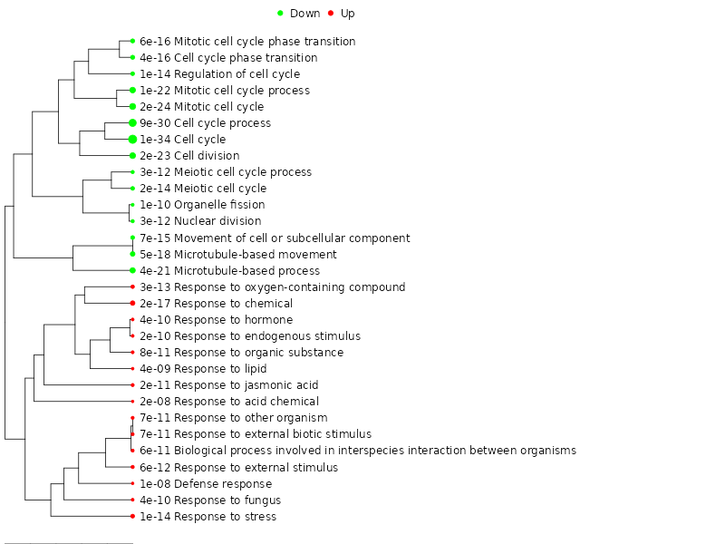

Within the graph, terms are connected by dendrongrams indicating parent-child relationships. A child term inherits the meaning of its parent, and adds additional specificity. For example, in the image, the term "mitotic cell cycle phase transition" (6e-16) is a child of the term "cell cycle phase transition" (4e-16). This indicates that a mitotic cell cycle phase transition is a specific kind of cell cycle phase transition. The numbers next to the terms in the image likely refer to p-values, which indicate the probability that a random association between genes and a term could have produced the observed amount of association. Lower p-values indicate a stronger association between the genes and the term.

The visualization, an excerpt from the comprehensive Gene Ontology (GO) term graph available through the GO consortium\[1], categorizes biological processes from general to specific. This categorization begins with the Cell Cycle, distinguishing between the Meiotic Cell Cycle, including the Meiotic Cell Cycle Process, and the Mitotic Cell Cycle, which is further divided into the Mitotic Cell Cycle Process and the Mitotic Cell Cycle Phase Transition. In another category, the Response to External Stimulus encompasses the Response to Chemical, which includes the Response to Hormone, and the Response to Other Organism, which includes the Defense Response and the Response to Fungus.

Here are some references that you may find helpful:

* The Gene Ontology Consortium. [http://geneontology.org/](http://geneontology.org/)

**Conclusion**

This comparative study between true lunar regolith and JSC-1A lunar simulant underscores the profound effects of the lunar material on gene expression. Not only does this research enhance our understanding of life's resilience in extraterrestrial environments, but it also provides critical insights for future lunar explorations and the development of bio-regenerative life support systems.

**Future Directions**

Further research is necessary to validate these findings and explore their implications for long-term lunar habitation and the viability of cultivating life-supporting ecosystems on the Moon.

### Identification of 4 Gene Clusters Through WGCNA

<figure><figcaption>
Ideniftifcation of Gene Clusters through Weighted Gene Co-expression Network Analysis,
</figcaption></figure>

Using Weighted Gene Co-expression Network Analysis (WGCNA), four distinct clusters have been identified based on their functional grouping. These clusters are delineated within the dendrogram that represents both gene expression and functional similarities. The clusters are categorized as follows: Turquoise, Brown, Yellow, and Blue. Each of these clusters has been characterized by the top 10 loci that define their respective grouping, providing key insights into the underlying gene expressions that demarcate each cluster.

**A few example "marker" loci from the 4 clusters identified by WGCNA**

Turquoise: GLR1.3, PER34 CEN2 and NAC047.

Brown: NRT1.1, PRX11C, WRK60, and TRX9

Yellow: SUS3, RABC2B, TSA1, BGLU18, GOLS1, PHO1-H10 and GLO5

Blue: SOD2, PAP24, UP6, and FAP2

Figure: GO terms with significant enrichment within the DEG’s from the Broad lunar location model.

**Table X: KEGG pathway enrichment**

| **Direction**  | **adj.Pval** | **nGenes** | **KEGG Pathways**                                                                |
| -------------- | ------------ | ---------- | -------------------------------------------------------------------------------- |
| Down regulated | 3.6e-03      | 9          | [Homologous recombination](http://www.genome.jp/kegg-bin/show\_pathway?ath03440) |
|                | 3.6e-03      | 7          | [Circadian rhythm](http://www.genome.jp/kegg-bin/show\_pathway?ath04712)         |

**Table X: AraCyc pathway enrichment**

| **Direction**  | **adj.Pval** | **nGenes** | **Ara Cyc Pathways**                   |
| -------------- | ------------ | ---------- | -------------------------------------- |
| Down regulated | 2.6e-05      | 8          | Thioredoxin pathway                    |
| Up regulated   | 3.7e-03      | 5          | Indole glucosinolate activation        |
|                | 3.7e-03      | 8          | Glutathione-mediated detoxification II |

**Table X: Reactome pathway enrichment**

| **Direction** | **adj.Pval** | **nGenes** | **Reactome Pathways**                                                                                            |
| ------------- | ------------ | ---------- | ---------------------------------------------------------------------------------------------------------------- |
| Up regulated  | 2.7e-03      | 5          | [R-ATH-1119473.1 Cytokinins-O-glucoside biosynthesis](http://plantreactome.gramene.org/index.php?lang=en)        |
|               | 2.7e-03      | 4          | [R-ATH-8879007.1 Response to cold temperature](http://plantreactome.gramene.org/index.php?lang=en)               |
|               | 6.2e-03      | 2          | [R-ATH-1119580.1 IAA biosynthesis II](http://plantreactome.gramene.org/index.php?lang=en)                        |
|               | 6.2e-03      | 3          | [R-ATH-1119438.1 Secologanin and strictosidine biosynthesis](http://plantreactome.gramene.org/index.php?lang=en) |

Table X: Transcription factor enrichment database STIF

| **Direction** | **adj.Pval** | **nGenes** | **STIF TFDB Pathways**                                                                                |
| ------------- | ------------ | ---------- | ----------------------------------------------------------------------------------------------------- |
| Up regulated  | 4.0e-11      | 67         | [G box bHLH target](http://caps.ncbs.res.in/cgi-bin/mini/databases/stifdb2/browse\_by\_tfacts.pl)     |
|               | 1.2e-10      | 112        | [W box WRKY target](http://caps.ncbs.res.in/cgi-bin/mini/databases/stifdb2/browse\_by\_tfacts.pl)     |
|               | 8.5e-09      | 120        | [HSE1 HSF target](http://caps.ncbs.res.in/cgi-bin/mini/databases/stifdb2/browse\_by\_tfacts.pl)       |
|               | 8.5e-09      | 114        | [Myb box1 MYB target](http://caps.ncbs.res.in/cgi-bin/mini/databases/stifdb2/browse\_by\_tfacts.pl)   |
|               | 1.4e-08      | 73         | [Myb box3 MYB target](http://caps.ncbs.res.in/cgi-bin/mini/databases/stifdb2/browse\_by\_tfacts.pl)   |
|               | 3.9e-05      | 51         | [DREB AP2 EREBP target](http://caps.ncbs.res.in/cgi-bin/mini/databases/stifdb2/browse\_by\_tfacts.pl) |
|               | 4.4e-05      | 53         | [Nac box NAC target](http://caps.ncbs.res.in/cgi-bin/mini/databases/stifdb2/browse\_by\_tfacts.pl)    |
|               | 6.8e-05      | 17         | [HBE HB target](http://caps.ncbs.res.in/cgi-bin/mini/databases/stifdb2/browse\_by\_tfacts.pl)         |
|               | 2.0e-04      | 64         | [AuxRE ARF target](http://caps.ncbs.res.in/cgi-bin/mini/databases/stifdb2/browse\_by\_tfacts.pl)      |
|               | 4.5e-04      | 49         | [G box2 bZIP target](http://caps.ncbs.res.in/cgi-bin/mini/databases/stifdb2/browse\_by\_tfacts.pl)    |
|               | 2.1e-03      | 33         | [Myb box4 MYB target](http://caps.ncbs.res.in/cgi-bin/mini/databases/stifdb2/browse\_by\_tfacts.pl)   |
|               | 2.6e-03      | 33         | [N box bHLH target](http://caps.ncbs.res.in/cgi-bin/mini/databases/stifdb2/browse\_by\_tfacts.pl)     |
|               | 8.7e-03      | 41         | [Myb box2 MYB target](http://caps.ncbs.res.in/cgi-bin/mini/databases/stifdb2/browse\_by\_tfacts.pl)   |

Table X: Transcription factor enrichment database GTRD

| **Direction**  | **adj.Pval** | **nGenes** | **TF targets from GTRD**                                                             |
| -------------- | ------------ | ---------- | ------------------------------------------------------------------------------------ |
| Down regulated | 2.0e-76      | 199        | [MYB3R3-Transcription factor MYB3R-3 target gene](http://gtrd.biouml.org/)           |
|                | 1.6e-40      | 105        | [RBR1-Retinoblastoma-related protein 1 target gene](http://gtrd.biouml.org/)         |
|                | 1.4e-18      | 68         | [E2FA-Transcription factor E2FA target gene](http://gtrd.biouml.org/)                |
|                | 1.1e-11      | 216        | [CCA1-Protein CCA1 target gene](http://gtrd.biouml.org/)                             |
|                | 9.7e-07      | 112        | [LHY-Protein LHY target gene](http://gtrd.biouml.org/)                               |
|                | 1.3e-03      | 181        | [ARR14-Two-component response regulator ARR14 target gene](http://gtrd.biouml.org/)  |
| Up regulated   | 9.7e-12      | 202        | [WRKY33-Probable WRKY transcription factor 33 target gene](http://gtrd.biouml.org/)  |
|                | 2.3e-08      | 154        | [WRKY18-WRKY transcription factor 18 target gene](http://gtrd.biouml.org/)           |
|                | 2.4e-07      | 138        | [WRKY40-Probable WRKY transcription factor 40 target gene](http://gtrd.biouml.org/)  |
|                | 1.6e-03      | 59         | [ATHB-6-Homeobox-leucine zipper protein ATHB-6 target gene](http://gtrd.biouml.org/) |
|                | 3.3e-03      | 99         | [KAN1-Transcription repressor KAN1 target gene](http://gtrd.biouml.org/)             |

DRB factors model Version 10

CORE SUPPRESSED 24 LOCI

Table: Enriched papers about suppressed core response is the "cold" or "blue light" slow growth response.

| **Blue Light- and Low Temperature-Regulated COR27 and COR28 Play Roles in the Arabidopsis Circadian Clock.**                               | **0.00003702781658218090** | **AT4G33980,AT5G24470,AT5G42900** | **27837007** |
| ------------------------------------------------------------------------------------------------------------------------------------------ | -------------------------- | --------------------------------- | ------------ |
| **A Bayesian approach for parameter estimation in the extended clock gene circuit of Arabidopsis thaliana.**                               | 0.0005174829475177940      | AT2G40080,AT3G46640,AT5G24470     | 24267177     |
| **Two new clock proteins, LWD1 and LWD2, regulate Arabidopsis photoperiodic flowering.**                                                   | 0.0020294138224070200      | AT1G68050,AT2G21660,AT2G40080     | 18676661     |
| **Functional redundancy and new roles for genes of the autonomous floral-promotion pathway.**                                              | 0.008911494884438870       | AT2G33830,AT5G42900,AT5G48250     | 18408043     |
| **Molecular characterization of the Brassica rapa auxin-repressed, superfamily genes, BrARP1 and BrDRM1.**                                 | 0.015323319353979200       | AT1G28330,AT2G33830               | 23065269     |
| **Actinidia DRM1--an intrinsically disordered protein whose mRNA expression is inversely correlated with spring budbreak in kiwifruit.**   | 0.015323319353979200       | AT1G28330,AT2G33830               | 23516402     |
| **DRM1 and DRM2 expression regulation: potential role of splice variants in response to stress and environmental factors in Arabidopsis.** | 0.015323319353979200       | AT1G28330,AT2G33830               | 24442277     |
| **COR27 and COR28 encode nighttime repressors integrating Arabidopsis circadian clock and cold response.**                                 | 0.015323319353979200       | AT4G33980,AT5G42900               | 27990760     |
| **COR27 and COR28 Are Novel Regulators of the COP1-HY5 Regulatory Hub and Photomorphogenesis in Arabidopsis.**                             | 0.015323319353979200       | AT4G33980,AT5G42900               | 32769132     |
| **COLD REGULATED 27 and 28 are targets of CONSTITUTIVELY PHOTOMORPHOGENIC 1 and negatively affect phytochrome B signalling.**              | 0.04594511456698950        | AT4G33980,AT5G42900               | 32890447     |

Enriched protein domain’s also indicate suppression of “cold response loci/pathway”

|   | CCT domain \[[IPR010402](http://www.ebi.ac.uk/interpro/IEntry?ac=IPR010402)]                   | 2.374895e-4 | 4 |
| - | ---------------------------------------------------------------------------------------------- | ----------- | - |
|   | Cold-regulated protein 27/28 \[[IPR044678](http://www.ebi.ac.uk/interpro/IEntry?ac=IPR044678)] | 0.006015    | 2 |

Figure x: Very detailed Metascape analysis of the location-specific distinction available on request.

### **References**

* Lange, M.J., and Lange, T. et al., 2015. A Pivotal Role of DELLAs in Regulating Multiple Hormone Signals. _Molecular Plant_, \[online] 8(9), pp.1273–1284. Available at: [https://doi.org/10.1016/j.molp.2015.09.011](https://doi.org/10.1016/j.molp.2015.09.011) \[Accessed Date].
* DELLA Protein SLR1 Integrates and Amplifies Salicylic Acid- and Jasmonic Acid-Dependent Innate Immunity in Rice. (2016). _PubMed_, \[online] Available at: [https://pubmed.ncbi.nlm.nih.gov/26829979/](https://pubmed.ncbi.nlm.nih.gov/26829979/) \[Accessed Date].
*   Paul, AL., Elardo, S.M. & Ferl, R. Plants grown in Apollo lunar regolith present stress-associated transcriptomes that inform prospects for lunar exploration. _Commun Biol_ 5, 382 (2022). https://doi.org/10.1038/s42003-022-03334-8

    Colebrook EH, Thomas SG, Phillips AL, Hedden P. The role of gibberellin signalling in plant responses to abiotic stress. J Exp Biol. 2014 Jan 1;217(Pt 1):67-75. doi: 10.1242/jeb.089938. PMID: 24353205.
* De Smet S, Cuypers A, Vangronsveld J, Remans T. Gene Networks Involved in Hormonal Control of Root Development in Arabidopsis thaliana: A Framework for Studying Its Disturbance by Metal Stress. Int J Mol Sci. 2015 Aug 14;16(8):19195-224. doi: 10.3390/ijms160819195. PMID: 26287175; PMCID: PMC4581294.
* Griffiths J, Murase K, Rieu I, Zentella R, Zhang ZL, Powers SJ, Gong F, Phillips AL, Hedden P, Sun TP, Thomas SG. Genetic characterization and functional analysis of the GID1 gibberellin receptors in Arabidopsis. Plant Cell. 2006 Dec;18(12):3399-414. doi: 10.1105/tpc.106.047415. Epub 2006 Dec 28. Erratum in: Plant Cell. 2007 Feb;19(2):726. PMID: 17194763; PMCID: PMC1785415.

